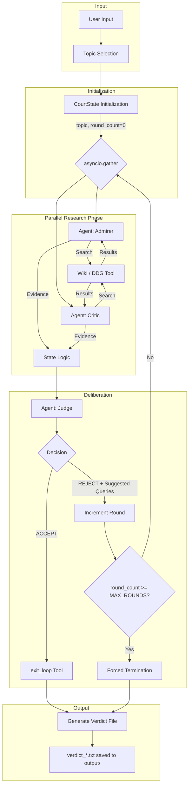

# ⚖️ The Historical Court

## Overview
**The Historical Court** is an agentic workflow system built with the **Google Agent Development Kit (ADK)** to evaluate historical figures and events through a multi-perspective lens. By employing biased AI historians and an impartial arbiter, the system simulates a trial to reach a balanced, evidence-based verdict on complex historical topics.

This project serves as a demonstration of modern AI engineering principles, specifically focusing on how to manage multi-agent systems with structured workflows and tool integration.

### Key AI Engineering Concepts
- **🎭 Orchestration**: Managing a stateful, multi-round loop between three specialized agents using a centralized state machine.
- **⚡ Parallelism**: Utilizing `asyncio.gather` for concurrent research execution, significantly reducing latency.
- **💾 State Management**: Maintaining a centralized `CourtState` to track evidence, round counts, and Judge feedback, including MD5-based deduplication.
- **🛠️ Tool Use (Function Calling)**: Empowering agents to interact with external APIs (Wikipedia & DuckDuckGo) and control the workflow via Google ADK's tool calling.

---

## 🏗️ Architecture

The system follows a centralized orchestration pattern:



---

## ✨ Features
- **ADK-Powered Agents**: Leveraging Google ADK for robust agentic behavior and seamless tool integration.
- **Multi-Provider Support**: Switch between Gemini API and Vertex AI via environment configuration.
- **Parallel Research**: Concurrent execution of Admirer and Critic agents to gather diverse viewpoints rapidly.
- **Intelligent Deduplication**: Uses MD5 hashes and title tracking to ensure evidence remains unique and relevant.
- **Themed CLI**: Rich terminal UI using the `rich` library, featuring panels, spinners, and structured logs.
- **Search Fallback**: Automatically queries DuckDuckGo if Wikipedia returns no results.

---

## 👥 Agent Profiles
| Agent | Role | Responsibility |
|-------|------|----------------|
| **⚖️ The Judge** | Impartial Arbiter | Evaluates evidence for balance, provides refined feedback/queries, and renders the final verdict. |
| **🎭 The Admirer** | Positive Historian | Focuses on achievements, innovations, and positive legacies using a favorable lens. |
| **📜 The Critic** | Critical Historian | Investigates controversies, failures, and negative impacts to ensure historical accountability. |

> For more details on prompts and agent configurations, see [docs/AGENT_PROFILES.md](docs/AGENT_PROFILES.md).

---

## 🚀 Installation

### Prerequisites
- Python 3.10+
- [Bun](https://bun.sh/) (Recommended for package management where applicable, though `pip` is standard here)

### Setup
```bash
# Clone the repository
git clone <repo-url>
cd historical-court

# Install dependencies (using pip)
pip install -r requirements.txt

# Configure environment
cp .env.example .env  # if available, or create a .env file
```

### Environment Configuration (.env)
```bash
GOOGLE_API_KEY='your-api-key'
MODEL_PROVIDER='google-api' # Or 'vertex-ai'
MODEL_NAME='gemini-2.0-flash'
MAX_ROUNDS=10
```

---

## 📖 Usage
Run the main script with the topic of investigation:

```bash
python main.py "Steve Jobs"
python main.py "Napoleon Bonaparte"
```

The system will execute the trial and save a detailed verdict report in the `output/` directory.

---

## 📂 Project Structure
- [`main.py`](main.py): The entry point and primary orchestrator of the trial loop.
- [`agents/`](agents/): Agent logic and ADK configurations.
- [`utils/`](utils/): Core utilities (state management, search tools, display engine, ADK helpers).
- [`docs/`](docs/): Detailed technical documentation and architecture diagrams.
- [`output/`](output/): Directory where final trial verdicts are stored (ignored by git).

---

## 🛠️ Key Dependencies
- `google-adk`: Core agent framework.
- `langchain-community` & `duckduckgo-search`: Research tools.
- `rich`: CLI visual presentation.
- `python-dotenv`: Configuration management.

---

## 📄 License & Credits
- **Educational Use**: This project is designed for educational purposes in the field of AI Engineering.
- **Authorship**: Created by Tanawat Sombatkamrai 663040117-7
