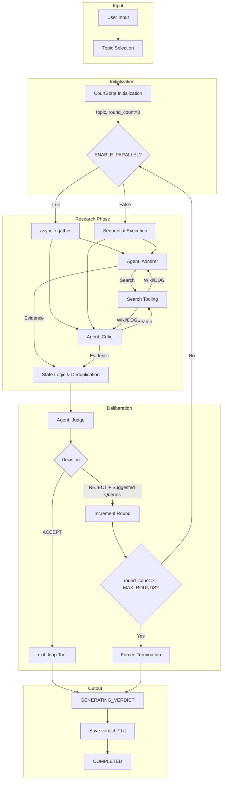

# ⚖️ The Historical Court

## Overview
**The Historical Court** is an agentic workflow system built with the **Google Agent Development Kit (ADK)** to evaluate historical figures and events through a multi-perspective lens. By employing biased AI historians and an impartial arbiter, the system simulates a trial to reach a balanced, evidence-based verdict on complex historical topics.

This project serves as a demonstration of modern AI engineering principles, specifically focusing on how to manage multi-agent systems with structured workflows and tool integration.

### Key AI Engineering Concepts
- **🎭 Orchestration**: Managing a stateful, multi-round loop between three specialized agents using a centralized state machine.
- **⚡ Parallelism (Optional)**: Uses `asyncio.gather` when enabled; the default path is sequential to simplify debugging.
- **💾 State Management**: Maintaining a centralized `CourtState` to track evidence, round counts, and Judge feedback, including MD5-based deduplication.
- **🛠️ Tool Use (Function Calling)**: Empowering agents to interact with external APIs (Wikipedia & DuckDuckGo) and control the workflow via Google ADK's tool calling.

---

## 🏗️ Architecture

The system follows a centralized orchestration pattern:



---

## ✨ Features
- **ADK-Powered Agents**: Leveraging Google ADK for robust agentic behavior and seamless tool integration.
- **Multi-Provider Support**: Switch between Gemini API and Vertex AI based on credentials and project settings.
- **Parallel Research (Toggleable)**: Optional concurrent execution of Admirer and Critic agents via `asyncio.gather`.
- **Intelligent Deduplication**: Uses MD5 hashes and title tracking to ensure evidence remains unique and relevant.
- **Themed CLI**: Rich terminal UI using the `rich` library, featuring panels, spinners, and structured logs.
- **Search Fallback**: The Critic agent can fall back to DuckDuckGo if Wikipedia returns no results.

---

## 👥 Agent Profiles
| Agent | Role | Responsibility |
|-------|------|----------------|
| **⚖️ The Judge** | Impartial Arbiter | Evaluates evidence for balance, provides refined feedback/queries, and renders the final verdict. |
| **🎭 The Admirer** | Positive Historian | Focuses on achievements, innovations, and positive legacies using a favorable lens. |
| **📜 The Critic** | Critical Historian | Investigates controversies, failures, and negative impacts to ensure historical accountability. |

> For more details on prompts and agent configurations, see [docs/AGENT_PROFILES.md](docs/AGENT_PROFILES.md).

---

## 🚀 Installation

### Prerequisites
- Python 3.10+
- [Bun](https://bun.sh/) (Recommended for package management where applicable, though `pip` is standard here)

### Setup
```bash
# Clone the repository
git clone <repo-url>
cd historical-court

# Install dependencies (using pip)
pip install -r requirements.txt

# Configure environment
cp .env.example .env  # if available, or create a .env file
```

### Environment Configuration (.env)
```bash
# Gemini API (choose one)
GOOGLE_API_KEY='your-api-key'
# or
GEMINI_API_KEY='your-api-key'

# Vertex AI (requires credentials + project/location)
GOOGLE_APPLICATION_CREDENTIALS='path/to/key.json'
GOOGLE_CLOUD_PROJECT='your-gcp-project'
GOOGLE_CLOUD_LOCATION='global'

# Model selection (defaults to gemini-2.5-flash)
MODEL='gemini-2.5-flash'
```

### Optional Runtime Tuning
```bash
# Logging
LOG_LEVEL='WARNING'

# ADK behavior
ADK_STATEFUL_SESSIONS='0'  # 1 to reuse sessions across rounds
AFC_MAX_REMOTE_CALLS='10'  # Limits automatic function calls per request

# Judge evidence truncation
JUDGE_EVIDENCE_MAX_CHARS='2400'
JUDGE_EVIDENCE_MAX_ITEM_CHARS='900'

# Wikipedia
WIKI_TOP_K='5'
WIKIPEDIA_DOC_CHARS_MAX='3000'
```

> Note: `MAX_ROUNDS`, `SHOW_STEPS`, and `ENABLE_PARALLEL` are currently configured as constants in [main.py](main.py).
> If a local `key.json` exists, the app sets `GOOGLE_APPLICATION_CREDENTIALS=key.json` automatically.

---

## 📖 Usage
Run the main script with the topic of investigation:

```bash
python main.py "Steve Jobs"
python main.py "Napoleon Bonaparte"
```

The system will execute the trial and save a detailed verdict report in the `output/` directory.

---

## 📂 Project Structure
- [`main.py`](main.py): Entry point coordinating initialization, research loop, and verdict saving.
- [`agents/`](agents/): Agent implementations using Google ADK.
  - [`admirer.py`](agents/admirer.py): Optimistic researcher.
  - [`critic.py`](agents/critic.py): Critical researcher with fallback.
  - [`judge.py`](agents/judge.py): Arbiter with adaptive query parsing.
- [`utils/`](utils/): Core utility modules.
  - [`state.py`](utils/state.py): `CourtState` and `TrialStatus` state machine.
  - [`wiki_tool.py`](utils/wiki_tool.py): Wikipedia search with adaptive filtering.
  - [`search.py`](utils/search.py): Orchestrated search with DuckDuckGo fallback.
  - [`config.py`](utils/config.py) & [`providers.py`](utils/providers.py): Configuration and provider management.
  - [`display.py`](utils/display.py): Rich terminal interface.
- [`docs/`](docs/): Technical documentation and architecture.
- [`output/`](output/): Storage for generated verdicts.

---

## 🛠️ Key Dependencies
- `google-adk>=1.0.0`: Core agent and tool orchestration.
- `langchain-community` & `wikipedia`: Wikipedia API integration.
- `duckduckgo-search`: Fallback search capabilities.
- `rich`: Advanced terminal UI.
- `python-dotenv`: Environment configuration.

---

## 📄 License & Credits
- **Educational Use**: This project is designed for educational purposes in the field of AI Engineering.
- **Authorship**: Created by Tanawat Sombatkamrai 663040117-7
