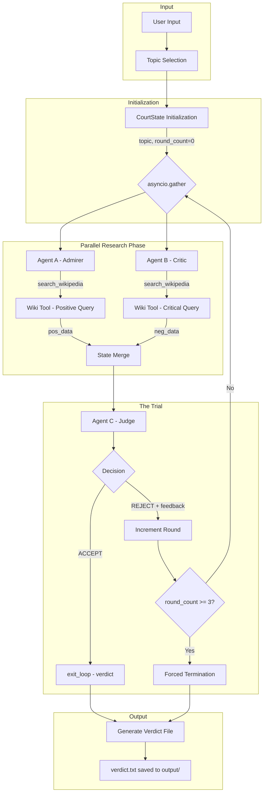
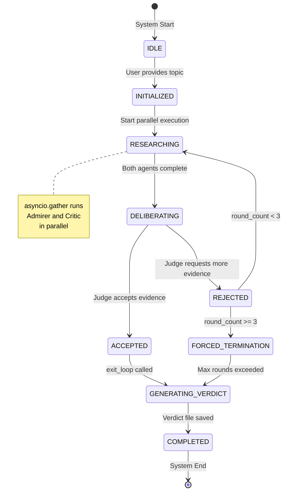
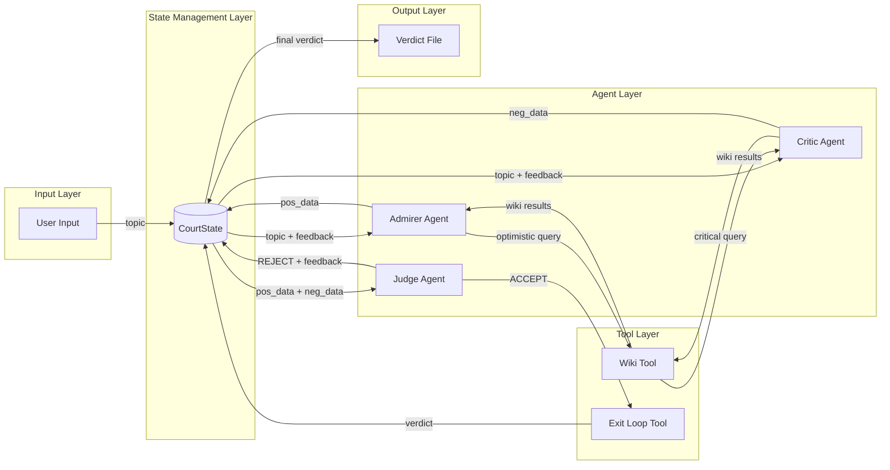
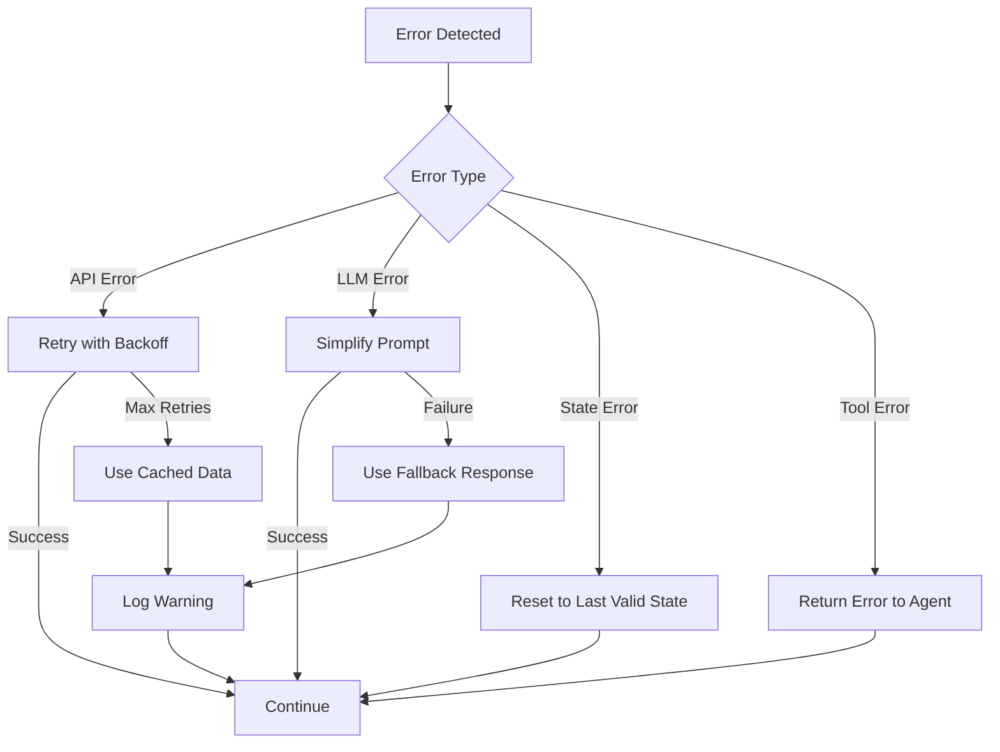

# The Historical Court - System Architecture

## 1. Executive Summary

**The Historical Court** is an agentic workflow system that demonstrates key concepts in modern AI engineering:
- **Orchestration**: Managing multiple AI agents in a coordinated workflow
- **Parallelism**: Concurrent execution using `asyncio.gather`
- **State Management**: Centralized state with `CourtState` dataclass
- **Tool Use**: Function calling for Wikipedia search and loop control

The system simulates a historical trial where two biased historians debate a topic while an impartial judge evaluates their arguments.

---

## 2. System Overview Diagram



---

## 3. Component Architecture

### 3.1 Project Structure

```
historical-court/
├── main.py              # Entry point - The orchestration loop
├── agents/
│   ├── __init__.py      # Agent exports
│   ├── admirer.py       # Agent A configuration and prompts
│   ├── critic.py        # Agent B configuration and prompts
│   └── judge.py         # Agent C configuration, prompts, and tools
├── utils/
│   ├── __init__.py      # Utility exports
│   ├── wiki_tool.py     # Wikipedia API wrapper implementation
│   └── state.py         # CourtState dataclass definition
├── docs/
│   ├── ARCHITECTURE.md  # This document
│   └── AGENT_PROFILES.md
├── output/              # Verdict files storage
├── requirements.txt     # Python dependencies
└── README.md            # Project documentation
```

### 3.2 Component Descriptions

| Component | File | Responsibility |
|-----------|------|----------------|
| **Orchestrator** | `main.py` | Controls the main loop, manages async execution, handles termination |
| **Admirer Agent** | `agents/admirer.py` | Generates positive queries, processes optimistic perspectives |
| **Critic Agent** | `agents/critic.py` | Generates critical queries, processes controversial perspectives |
| **Judge Agent** | `agents/judge.py` | Evaluates evidence, makes decisions, calls exit_loop tool |
| **State Manager** | `utils/state.py` | Defines and manages CourtState dataclass |
| **Wiki Tool** | `utils/wiki_tool.py` | Wraps wikipedia-api for search queries |

---

## 4. State Machine Diagram



### 4.1 State Transitions Table

| Current State | Event | Next State | Actions |
|---------------|-------|------------|---------|
| IDLE | topic_received | INITIALIZED | Create CourtState with topic |
| INITIALIZED | start_trial | RESEARCHING | Launch asyncio.gather |
| RESEARCHING | agents_complete | DELIBERATING | Merge pos_data and neg_data |
| DELIBERATING | judge_accepts | ACCEPTED | Prepare exit_loop |
| DELIBERATING | judge_rejects | REJECTED | Store feedback, increment round |
| REJECTED | round < 3 | RESEARCHING | Use feedback for refined queries |
| REJECTED | round >= 3 | FORCED_TERMINATION | Prepare forced verdict |
| ACCEPTED | exit_loop_called | GENERATING_VERDICT | Extract verdict from tool call |
| FORCED_TERMINATION | timeout | GENERATING_VERDICT | Generate summary verdict |
| GENERATING_VERDICT | file_saved | COMPLETED | Write to output/ directory |

---

## 5. Data Flow Architecture

### 5.1 CourtState Definition

```python
from dataclasses import dataclass, field
from typing import Optional
from enum import Enum

class TrialStatus(Enum):
    IDLE = "idle"
    INITIALIZED = "initialized"
    RESEARCHING = "researching"
    DELIBERATING = "deliberating"
    ACCEPTED = "accepted"
    REJECTED = "rejected"
    FORCED_TERMINATION = "forced_termination"
    GENERATING_VERDICT = "generating_verdict"
    COMPLETED = "completed"

@dataclass
class CourtState:
    topic: str
    pos_data: list[str] = field(default_factory=list)
    neg_data: list[str] = field(default_factory=list)
    round_count: int = 0
    feedback: Optional[str] = None
    status: TrialStatus = TrialStatus.IDLE
    verdict: Optional[str] = None
    max_rounds: int = 3
```

### 5.2 Data Flow Diagram



### 5.3 Message Passing Protocol

1. **Topic Injection**: User topic → CourtState.topic
2. **Query Generation**: Agents read topic + feedback → Generate search queries
3. **Wiki Search**: Queries → Wiki Tool → Raw results
4. **Data Processing**: Raw results → Agent processing → Structured data
5. **State Update**: Processed data → CourtState.pos_data / neg_data
6. **Evidence Submission**: CourtState → Judge evaluation
7. **Decision Output**: Judge → ACCEPT with verdict OR REJECT with feedback
8. **Loop Control**: Feedback → State update → Next round OR exit_loop → Termination

---

## 6. Tool Definitions

### 6.1 search_wikipedia Tool

**Purpose**: Query Wikipedia for relevant historical information

```python
search_wikipedia_schema = {
    "name": "search_wikipedia",
    "description": "Search Wikipedia for information about a historical topic. Returns summarized content from relevant Wikipedia articles.",
    "parameters": {
        "type": "object",
        "properties": {
            "query": {
                "type": "string",
                "description": "The search query to find relevant Wikipedia articles. Should be specific and focused on the aspect of the topic being researched."
            },
            "max_results": {
                "type": "integer",
                "description": "Maximum number of article summaries to return. Default is 3.",
                "default": 3
            }
        },
        "required": ["query"]
    }
}
```

**Implementation Notes**:
- Uses `wikipedia-api` Python library
- Returns structured summaries with source attribution
- Handles disambiguation pages gracefully
- Implements rate limiting to avoid API throttling

### 6.2 exit_loop Tool

**Purpose**: Signal trial completion and provide final verdict

```python
exit_loop_schema = {
    "name": "exit_loop",
    "description": "Called by the Judge when sufficient evidence has been gathered and a fair verdict can be rendered. This terminates the trial loop and outputs the final verdict.",
    "parameters": {
        "type": "object",
        "properties": {
            "verdict": {
                "type": "string",
                "description": "The final verdict summarizing the historical figures achievements and controversies in a balanced manner."
            },
            "confidence": {
                "type": "string",
                "enum": ["low", "medium", "high"],
                "description": "The judges confidence level in the verdict based on evidence quality."
            },
            "summary": {
                "type": "object",
                "properties": {
                    "key_achievements": {
                        "type": "array",
                        "items": {"type": "string"},
                        "description": "List of notable achievements from the Admirers evidence"
                    },
                    "key_controversies": {
                        "type": "array",
                        "items": {"type": "string"},
                        "description": "List of notable controversies from the Critics evidence"
                    }
                }
            }
        },
        "required": ["verdict", "confidence"]
    }
}
```

**Implementation Notes**:
- Only callable by the Judge agent
- Triggers immediate loop termination
- Verdict is written to `output/verdict_{topic}_{timestamp}.txt`

---

## 7. Async Execution Pattern

### 7.1 Parallel Execution Strategy

```python
async def run_parallel_research(state: CourtState) -> CourtState:
    """Execute Admirer and Critic agents in parallel."""
    
    # Create agent tasks
    admirer_task = run_admirer_agent(state.topic, state.feedback)
    critic_task = run_critic_agent(state.topic, state.feedback)
    
    # Execute in parallel using asyncio.gather
    pos_result, neg_result = await asyncio.gather(
        admirer_task,
        critic_task,
        return_exceptions=True  # Handle individual failures gracefully
    )
    
    # Update state with results
    state.pos_data.append(pos_result)
    state.neg_data.append(neg_result)
    state.round_count += 1
    
    return state
```

### 7.2 Main Orchestration Loop

```python
async def run_trial(topic: str) -> str:
    """Main orchestration loop for the historical trial."""
    
    # Initialize state
    state = CourtState(topic=topic)
    state.status = TrialStatus.INITIALIZED
    
    while state.round_count < state.max_rounds:
        # Phase 1: Parallel Research
        state.status = TrialStatus.RESEARCHING
        state = await run_parallel_research(state)
        
        # Phase 2: Judge Deliberation
        state.status = TrialStatus.DELIBERATING
        decision = await run_judge_agent(state)
        
        if decision.accepted:
            state.status = TrialStatus.ACCEPTED
            state.verdict = decision.verdict
            break
        else:
            state.status = TrialStatus.REJECTED
            state.feedback = decision.feedback
    
    # Handle forced termination
    if state.verdict is None:
        state.status = TrialStatus.FORCED_TERMINATION
        state.verdict = await generate_forced_verdict(state)
    
    # Generate output
    state.status = TrialStatus.GENERATING_VERDICT
    output_path = await save_verdict(state)
    state.status = TrialStatus.COMPLETED
    
    return output_path
```

---

## 8. Error Handling Strategy

### 8.1 Error Categories

| Category | Examples | Handling Strategy |
|----------|----------|-------------------|
| **API Errors** | Wikipedia rate limiting, network failures | Exponential backoff with retry |
| **LLM Errors** | Token limits, malformed responses | Graceful degradation with fallback prompts |
| **State Errors** | Invalid transitions, data corruption | State validation at each transition |
| **Tool Errors** | Invalid tool calls, missing parameters | Parameter validation and error feedback |

### 8.2 Graceful Degradation



---

## 9. Technical Requirements

### 9.1 Dependencies

```
# requirements.txt
google-adk>=1.0.0
aiohttp>=3.9.0
asyncio>=3.4.3
python-dotenv>=1.0.0
```

### 9.2 Environment Configuration

```bash
# .env file
GOOGLE_API_KEY=your_api_key_here
WIKIPEDIA_USER_AGENT=HistoricalCourt/1.0
MAX_ROUNDS=3
OUTPUT_DIR=./output
```

### 9.3 Runtime Requirements

- Python 3.10+ for native asyncio support
- Sufficient API quota for Google Gemini via ADK
- Network access for Wikipedia API
- Write permissions for output directory

---

## 10. Security Considerations

1. **API Key Management**: Use environment variables, never commit keys
2. **Input Sanitization**: Validate and sanitize user topic input
3. **Rate Limiting**: Implement client-side rate limiting for APIs
4. **Output Validation**: Sanitize verdict content before file write
5. **Error Messages**: Avoid exposing internal details in error outputs

---

## 11. Extensibility Points

| Extension Point | Description | Implementation |
|-----------------|-------------|----------------|
| **New Agents** | Add additional perspectives | Implement Agent interface, register in orchestrator |
| **New Tools** | Add research capabilities | Define schema, implement handler, register with agents |
| **State Persistence** | Save/resume trials | Implement StateRepository interface |
| **Output Formats** | Support multiple formats | Implement OutputFormatter interface |
| **Custom Prompts** | Domain-specific trials | Configuration-driven prompt templates |

---

## 12. Revision History

| Version | Date | Author | Changes |
|---------|------|--------|---------|
| 1.0 | 2024-XX-XX | System Architect | Initial architecture document |
