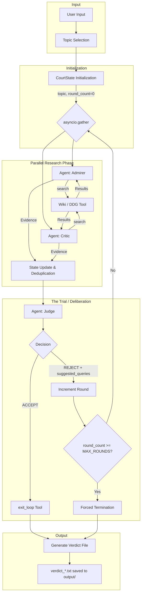

# The Historical Court - System Architecture

## 1. Executive Summary

**The Historical Court** is an agentic workflow system built with the Google Agent Development Kit (ADK) that demonstrates key concepts in modern AI engineering:
- **Orchestration**: Centralized management of multiple AI agents in a coordinated state-machine workflow.
- **Parallelism**: Concurrent execution of research agents using `asyncio.gather`.
- **State Management**: Centralized state with the `CourtState` dataclass, including content deduplication.
- **Tool Use**: Function calling for Wikipedia and DuckDuckGo search, and loop control via the Judge.
- **Multi-Provider Support**: Seamlessly switching between Gemini API and Vertex AI.

The system simulates a historical trial where two biased historians (The Admirer and The Critic) research a topic from opposing viewpoints, while an impartial Judge evaluates their findings to produce a balanced verdict.

---

## 2. System Overview Diagram



---

## 3. Component Architecture

### 3.1 Project Structure

```
historical-court/
├── main.py              # Entry point - Centralized orchestration loop
├── agents/
│   ├── admirer.py       # Biased Historian (Pros) - Optimistic queries
│   ├── critic.py        # Cynical Historian (Cons) - Critical queries
│   └── judge.py         # Impartial Arbiter - Evaluation and exit logic
├── utils/
│   ├── adk_helpers.py   # ADK stream extraction utilities
│   ├── adk_model.py     # Gemini/Vertex AI model initialization
│   ├── config.py        # Env var management (python-dotenv)
│   ├── display.py       # Rich CLI presentation
│   ├── state.py         # CourtState and deduplication logic
│   ├── wiki_tool.py     # Wikipedia search with exclusion patterns
│   └── search.py        # Search fallback (DuckDuckGo)
├── docs/
│   ├── ARCHITECTURE.md  # This document
│   ├── AGENT_PROFILES.md
│   └── MULTI_PROVIDER_DESIGN.md
├── output/              # Final verdict storage
├── requirements.txt     # Dependencies (google-adk, langchain, rich, etc.)
└── README.md            # Quickstart and overview
```

### 3.2 Component Descriptions

| Component | File(s) | Responsibility |
|-----------|---------|----------------|
| **Orchestrator** | `main.py` | Implementation of the trial state machine and async task management. |
| **Admirer Agent** | `agents/admirer.py` | Research focused on achievements and positive legacy. |
| **Critic Agent** | `agents/critic.py` | Research focused on controversies and failures. |
| **Judge Agent** | `agents/judge.py` | Quality control, balance evaluation, and final verdict synthesis. |
| **State Manager** | `utils/state.py` | Tracks topic, evidence, rounds, and deduplicates content using MD5 hashes. |
| **Research Tools** | `utils/wiki_tool.py`, `utils/search.py` | Wikipedia primary search with DuckDuckGo fallback. |
| **Display Engine** | `utils/display.py` | ASCII/Rich-based CLI visualization with panels and spinners. |

---

## 4. State Machine

The system transitions through a defined set of states managed in the `main.py` loop:

1. **INITIALIZED**: Topic received, `CourtState` created.
2. **RESEARCHING**: Admirer and Critic run concurrently. High-level parallelization using `asyncio.gather`.
3. **DELIBERATING**: Judge reviews synthesized evidence.
4. **REJECTED**: Judge provides feedback and "Suggested Queries" for the next round.
5. **ACCEPTED**: Judge calls `exit_loop` tool with a final verdict.
6. **FORCED_TERMINATION**: Reached if `MAX_ROUNDS` (default 10) is hit without consensus.
7. **COMPLETED**: Verdict saved to `output/` and displayed.

---

## 5. Data Management & Deduplication

### 5.1 CourtState
The `CourtState` dataclass (`utils/state.py`) is the source of truth, containing:
- `topic`: The historical subject.
- `evidence`: List of unique research findings.
- `seen_hashes`: A set of MD5 hashes for content deduplication.
- `seen_titles`: A set of processed page titles to avoid redundant searches.
- `suggested_queries`: Refined search terms from the Judge.

### 5.2 Deduplication Logic
To maintain quality and reduce costs:
- **Hash-based**: Each piece of evidence is hashed; duplicates are discarded before adding to state.
- **Title tracking**: Wikipedia article titles are tracked to prevent agents from revisiting the same pages in subsequent rounds.

---

## 6. Tooling

### 6.1 Research Tools
- **search_wikipedia**: Primary source. Implements exclusion patterns (e.g., "See also", "References") to filter noise.
- **DuckDuckGo**: Fallback tool used if Wikipedia returns zero results for a specialized query.

### 6.2 Orchestration Tools
- **exit_loop**: The Judge's mechanism to stop the trial. It accepts a structured verdict including `verdict_text`, `key_achievements`, and `key_controversies`.

---

## 7. Configuration & Multi-Provider Support

Managed via `utils/adk_model.py` and `.env`:
- **Providers**: Supports `google-api` (Gemini API) and `vertex-ai`.
- **Environment**: Sensitive keys and max rounds are handled by `python-dotenv`.

---

## 8. Technical Requirements

- **Python 3.10+**
- **google-adk**: For Agent/Tool framework.
- **langchain-community**: Powering the Wikipedia/DDG integrations.
- **rich**: For terminal UI.
- **python-dotenv**: For configuration.

---
