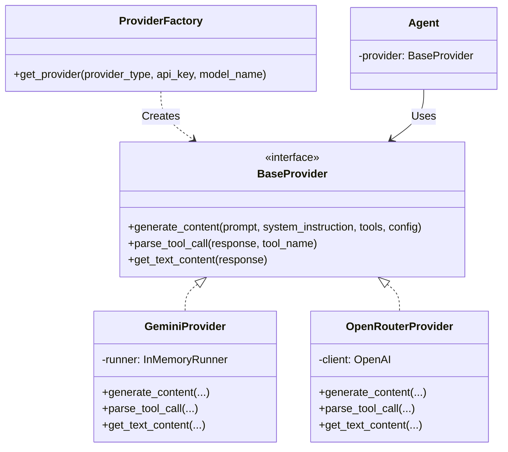

# Multi-Provider Abstraction Design

## 1. Executive Summary

This document outlines the design for a **Provider Abstraction Layer** to support multiple AI providers (initially Google Gemini via ADK and OpenRouter) in The Historical Court project. The goal is to decouple the agent logic from specific SDKs (`google-adk`), allowing seamless switching between providers via configuration.

## 2. Architecture Overview

We will introduce a new module `utils/providers` that implements a **Strategy Pattern** for LLM interaction. Agents will no longer instantiate ADK runners directly. Instead, they will request a `BaseProvider` instance from a `ProviderFactory`.



### 2.1 File Structure

New files to be created:

```
utils/
└── providers/
    ├── __init__.py        # Exports
    ├── base.py            # Abstract Base Class (Protocol)
    ├── gemini.py          # Google Gemini Implementation
    ├── openrouter.py      # OpenRouter (OpenAI-compatible) Implementation
    └── factory.py         # Factory for instantiation
```

## 3. Interface Definitions

### 3.1 Base Provider Protocol (`utils/providers/base.py`)

The interface abstracts the core differences: client initialization, content generation, and response parsing.

```python
from typing import Any, Dict, List, Optional, Protocol, Union

class LLMProvider(Protocol):
    """Abstract interface for LLM providers."""

    async def generate_content(
        self,
        prompt: str,
        system_instruction: Optional[str] = None,
        tools: Optional[List[Dict[str, Any]]] = None,
        temperature: float = 0.7,
        max_tokens: int = 1000,
    ) -> Any:
        """
        Generate content from the LLM.
        
        Args:
            prompt: The user prompt.
            system_instruction: System prompt/instruction.
            tools: List of tool definitions (OpenAI format).
            temperature: Generation temperature.
            max_tokens: Max output tokens.
            
        Returns:
            Raw response object (provider-specific).
        """
        ...

    def get_text_content(self, response: Any) -> str:
        """Extract text content from the provider-specific response."""
        ...

    def parse_tool_call(self, response: Any, tool_name: str) -> Optional[Dict[str, Any]]:
        """
        Extract arguments for a specific tool call.
        
        Returns:
            Dictionary of arguments if tool was called, else None.
        """
        ...
```

### 3.2 Standardized Tool Schema

To support multiple providers, we will standardize on the **OpenAI Function Calling Format** (JSON Schema) as the "canonical" format in our code.
- **OpenRouterProvider**: Uses this format directly.
- **GeminiProvider**: Will translate this format to ADK function tools internally.

**Example Canonical Tool Schema (Judge's exit_loop):**
```python
EXIT_LOOP_SCHEMA = {
    "type": "function",
    "function": {
        "name": "exit_loop",
        "description": "Called by the Judge when sufficient evidence has been gathered...",
        "parameters": {
            "type": "object",
            "properties": {
                "verdict": {"type": "string", "description": "..."},
                "confidence": {"type": "string", "enum": ["low", "medium", "high"]},
                # ...
            },
            "required": ["verdict", "confidence"]
        }
    }
}
```

## 4. Implementation Details

### 4.1 Gemini Provider (`utils/providers/gemini.py`)
- **Dependency**: `google-adk`
- **Translation**:
  - **Input**: Converts canonical JSON schema tools -> `types.FunctionDeclaration` -> `types.Tool`.
  - **Output**: Extracts text from `response.text`.
  - **Tool Call**: helper to extract `part.function_call`.

### 4.2 OpenRouter Provider (`utils/providers/openrouter.py`)
- **Dependency**: `openai` (Standard Python SDK)
- **Configuration**:
  - `base_url="https://openrouter.ai/api/v1"`
  - `api_key=OPENROUTER_API_KEY`
- **Logic**:
  - Uses `client.chat.completions.create`.
  - Maps `system_instruction` to a `system` message.
  - Maps `prompt` to a `user` message.

### 4.3 Factory (`utils/providers/factory.py`)

```python
import os
from .base import LLMProvider
from .gemini import GeminiProvider
from .openrouter import OpenRouterProvider

def get_provider(provider_type: str = None) -> LLMProvider:
    provider_type = provider_type or os.getenv("LLM_PROVIDER", "gemini")
    
    if provider_type.lower() == "gemini":
        api_key = os.getenv("GOOGLE_API_KEY") or os.getenv("GEMINI_API_KEY")
        model = os.getenv("LLM_MODEL", "gemini-2.0-flash")
        return GeminiProvider(api_key=api_key, model=model)
        
    elif provider_type.lower() == "openrouter":
        api_key = os.getenv("OPENROUTER_API_KEY")
        model = os.getenv("LLM_MODEL", "google/gemini-2.0-flash-001") # OpenRouter ID
        return OpenRouterProvider(api_key=api_key, model=model)
        
    raise ValueError(f"Unknown provider: {provider_type}")
```

## 5. Configuration & Environment Variables

We will support the following environment variables (defined in `.env` or system):

| Variable | Description | Default |
|----------|-------------|---------|
| `LLM_PROVIDER` | `gemini` or `openrouter` | `gemini` |
| `LLM_MODEL` | Model ID (e.g., `gemini-2.0-flash`, `anthropic/claude-3-opus`) | `gemini-2.0-flash` |
| `GOOGLE_API_KEY` | Key for Google Gemini | (Required for Gemini) |
| `OPENROUTER_API_KEY` | Key for OpenRouter | (Required for OpenRouter) |

**Backward Compatibility:**
If `LLM_PROVIDER` is missing, it defaults to `gemini`, preserving existing behavior using `GOOGLE_API_KEY`.

## 6. Migration Path

### Step 1: Install Dependencies
Add `openai` to `requirements.txt`.

### Step 2: Implement Provider Layer
Create the `utils/providers/` module with the implementation described above.

### Step 3: Refactor Agents
We will refactor `AdmirerAgent`, `CriticAgent`, and `JudgeAgent` one by one.

**Before (Admirer):**
```python
class AdmirerAgent:
    def __init__(self, api_key):
        self.runner = InMemoryRunner(agent=agent, app_name="historical-court")
        
    async def generate(self):
        await self.client.aio.models.generate_content(...)
```

**After (Admirer):**
```python
from utils.providers.factory import get_provider

class AdmirerAgent:
    def __init__(self, api_key=None): # api_key optional, handled by factory/env
        self.provider = get_provider() 
        
    async def generate(self):
        response = await self.provider.generate_content(
            prompt=...,
            system_instruction=ADMIRER_SYSTEM_PROMPT
        )
        text = self.provider.get_text_content(response)
```

### Step 4: Refactor Judge Tool Handling
The Judge is complex because of `exit_loop`.
1. Redefine `exit_loop` schema in OpenAI JSON format in `agents/judge.py`.
2. Update `deliberate` method to pass this schema to `provider.generate_content(..., tools=[EXIT_LOOP_SCHEMA])`.
3. Use `provider.parse_tool_call(response, "exit_loop")` to extract verdict.

## 7. Example Usage

```python
# main.py initialization
from utils.providers.factory import get_provider

# The factory reads env vars automatically
# No need to pass api_key explicitly down the chain if using env vars
admirer = AdmirerAgent() 
critic = CriticAgent()
judge = JudgeAgent()

# OR specific override
custom_provider = get_provider("openrouter")
admirer = AdmirerAgent(provider=custom_provider)
```
